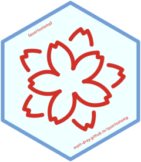

# {quartostamp} 

<!-- badges: start -->
[](https://www.repostatus.org/#active)
[](https://github.com/matt-dray/quartostamp/actions/workflows/R-CMD-check.yaml)
[](https://github.com/matt-dray/quartostamp/actions/workflows/air-format.yaml)
[](https://github.com/matt-dray/quartostamp/actions/workflows/jarl-lint.yaml)
[![rostrum.blog
posts](https://img.shields.io/badge/rostrum.blog-black?style=flat&labelColor=00ff00&logo=data%3Aimage%2Fgif%3Bbase64%2CR0lGODdhoACgAJEAAAAAAP%2F%2F%2FwAAAAAAACH5BAlkAAIALAAAAACgAKAAAAL%2FlI%2BpywgPY5u02hQzuLz7r0nfSBohVKbqdT7rS7UbTMNyjR93zoNtX9sBh7EfcSU8Kh3GJSnpVEKjnCkVaL0WT1pps2vJgr1cp3gMPufU6Cs7%2BG233zS6nByK2u%2FEPTLO1%2BWnMhi4BjhUaAhXtqS4aIOIJQmJpvhYqXVJmbm42dgZ%2BpkXWjqqUWrKOYGZioc60urat9ogOzsJ2nGLy3Oa0VtVy3AmUzy8wMuCrHBsTErMjCH9pytszfQMG40dRk34bcKpDZ0cLqDs3V3hTI5ie57OHj%2FuLsJdvnv%2BRL%2BObv8O3zYP8rbku3YwG0BW%2FRLmcjjPH8CA5vwxtIjj172K%2FwvhYRQITE67gc0mzgC5seRHS%2FUkmrwI8d%2FKMSNDotQGk%2BS0mWlaxjR5kqNOhUMN1Uy5s%2BNNFx5j3jlKUaVSoTapIvXks6i4iTmrStXKByrTpca6XtWxz0xWr0ntmY3ali1Wl3SnfpWLlqeghkDdxkrriG9fcvz0ahI8%2BFlhpyIRJ9YIdy5jso%2FBvh2bCXLlyVYjG3W82XJT0XNAhz4bkTNN06cx6zPshnXrxaQzv1TLNZg6u7Ry6zboN7Dv36Pd6blNvDhh3LyTEzXOPLjzu8uFN58u83oPoNg7K44Ovfvz6q%2FCi0%2FRuuz5w%2Blhr6%2FWvvZ7RvHxzn9Y3%2FP97fnt7%2F8%2F1J9%2B%2F2UUoIAD1lGgawf6kmBQ54mlHmVrkUedgQTWJV2F30mIoX8A%2FoScdxGKCOFxHVIYF4rj4aSchfSBxV2LG5I4oYsInsgihyAOp6GDve2oXXYZppijiCYCOeSKM%2FZYInioCWkekzUuSaSCiUw5opQ4Uqmkj3tt6WVeQTbZCZk0gnlZmIGYqSWS%2FhX0IYxYslmlmmFhmSadXaqCpoxZ1pkmn24%2BGSNZgYqCp596iilfT33qKOejtknaZqSD2hgMhIsuaKSiiXKamqVJMuohqFtdyiWpT5p6qqhRAsrqoZC%2BCdh6mn4aa6ezElrrg3PimiusuwoIJ6I81nmre4L%2Fjtrqq10WW9qxz%2F6qrLFjhlhpqb8Veiaqf3bHbba8SotduMhSq1ov5k4LJrQskdusiqoW6Su8UMobL73qAnsupcJO6m2e%2FO5pravjXuuvZAYTi%2B2%2FPS5La7sDz2vlZwlT%2FC3GsgK8cMX5pvqxne5GcnHIm96LqaMBe1oyyh7f2fK6GvsJ8cEdZxzyxpWcLHPONBccsbc89%2FrjzQLHTPSVSNt78lMTm%2Fy0y3Y6vTTCK5cZdc9S6wzJ0ExHTfXV3Rr9c7TpEjzsy5pNfeHZM6ctsmlHNor22EHT%2FXZ5q5Ztt83a6qp3ynWLy7B7IzuM0M1N833E2keL%2FZrb6MnNMuSJPv9NsuRbV062D9V6rnmyli%2FzOceYIx7s5IYnnbrjqWeOt8%2Bvwxf75rODs3rpt7t%2Bu%2Bqhsx4s773TdvrgkBQAADs%3D)](https://www.rostrum.blog/index.html#category=quartostamp)
<!-- badges: end -->

## About

An R package containing an [RStudio Addin](https://rstudio.github.io/rstudioaddins/) to insert pre-written fenced-divs, classes and markers into your [Quarto](https://quarto.org/) documents.

See the [package website](https://matt-dray.github.io/quartostamp/) for the [full list of available functions](https://matt-dray.github.io/quartostamp/reference/index.html) and the [Quarto website](https://quarto.org/docs/guide/) for full Quarto documentation.

Why 'quartostamp'?
Historically, pre-prepared blocks were stamped physically into [paper quartos](https://en.wikipedia.org/wiki/Quarto).
Now you can digitally stamp pre-prepared blocks into your Quarto file.

## Install

Install the development version [from GitHub](https://github.com/matt-dray/quartostamp/):

``` r
install.packages("pak") # if not yet installed
pak::pak("matt-dray/quartostamp")
```

Restart RStudio to add the functions to the Addins menu.

## Use

### Addins menu

To use: 

1. Put the cursor in your Quarto file where you'd like to insert an element.
Alternatively, highlight some text that you would like to use in the body of an element.
2. Click the 'RStudio Addins' dropdown at the top of the RStudio IDE.
3. Scroll/search for 'QUARTOSTAMP' and click the function you want.

So, if you're writing a Revealjs presentation, you might highlight this text in your qmd file:

```
Here is some text.
```

And then select 'Insert speaker notes' from the Addins menu to get this:

```
::: {.notes}
Here is some text.
:::
```

If you hadn't selected any text, you would get the skeleton:

```
::: {.notes}
Speaker notes (press 's' when presenting to switch to speaker mode).
:::
```

### Shortcuts

You could create [custom RStudio keyboard shortcuts](https://support.rstudio.com/hc/en-us/articles/206382178-Customizing-Keyboard-Shortcuts-in-the-RStudio-IDE) for these functions:

1. Go to 'Tools' then 'Modify Keyboard Shortcuts...'
3. Search for the {quartostamp} function that you want a shortcut for.
4. Click in the 'Shortcut' column and type the key combination you want to use.
5. Click 'Apply'.

### Functions

You could also use the functions as ordinary R functions.
Use the help files or [documentation site](https://matt-dray.github.io/quartostamp/reference/index.html) to learn more about each one.
They all start with `stamp_` so you can search for help files from the R console like `?stamp_notes`.

## Related

Other packages can be used alongside {quartostamp} when writing a document:

* [the {remedy} package](https://thinkr-open.github.io/remedy/) contains an RStudio Addin with a large number of R Markdown helpers, e.g. 'H2' will add leading hashmarks (`##`) to signify a level-two header
* [the {htmltools} package](https://rstudio.github.io/htmltools/) has functions to insert HTML tags, e.g. `tags$h2()` will insert `<h2></h2>` for a level-two header

## Contribute

Please [add requests as GitHub issues](https://github.com/matt-dray/quartostamp/issues), or raise a pull request.
